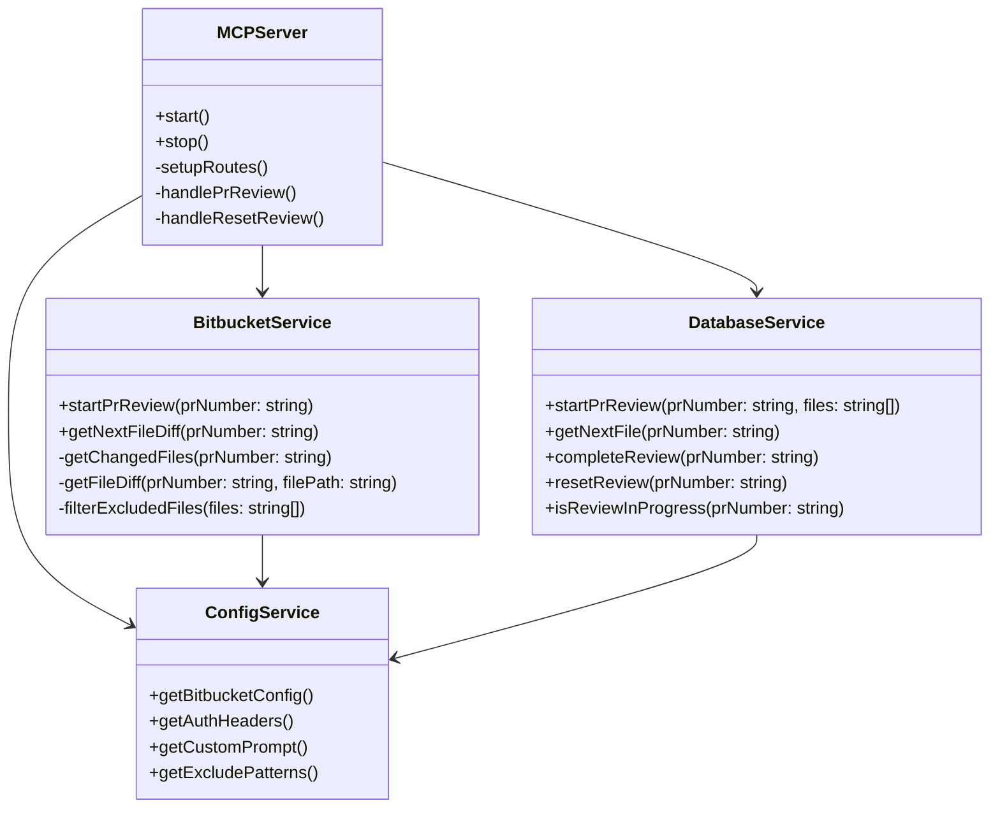

# Technical Specification Document

# Bitbucket PR Reviewer MCP Server

## 1. System Overview

### 1.1 Purpose

This document provides detailed technical specifications for the Bitbucket PR Reviewer MCP Server, including architecture, components, and implementation details.

### 1.2 Technology Stack

- **Runtime**: Node.js 18+
- **Language**: TypeScript 5.0+
- **Web Framework**: Express.js
- **Database**: SQLite (embedded)
- **Authentication**: Basic Auth / Token-based
- **Package Manager**: npm / yarn
- **Testing**: Jest, Supertest
- **Linting/Formatting**: ESLint, Prettier
- **Containerization**: Docker

## 2. System Architecture

### 2.2 Component Diagram



## 3. Detailed Component Specifications

### 3.1 MCPServer Class

**Purpose**: Main application server that handles HTTP requests and routes them to appropriate services.

**Key Methods**:

- `start(port: number)`: Starts the HTTP server
- `setupRoutes()`: Configures API endpoints
- `handlePrReview(req, res, next)`: Handles PR review requests
- `handleResetReview(req, res, next)`: Handles review reset requests

**Dependencies**:

- Express.js for HTTP server
- BitbucketService for Bitbucket interactions
- DatabaseService for data persistence
- ConfigService for configuration

### 3.2 BitbucketService Class

**Purpose**: Handles all interactions with the Bitbucket Server API.

**Key Methods**:

- `startPrReview(prNumber: string)`: Initiates a new PR review
- `getNextFileDiff(prNumber: string)`: Retrieves the next file diff for review
- `getChangedFiles(prNumber: string)`: Fetches list of changed files in PR
- `getFileDiff(prNumber: string, filePath: string)`: Gets diff for a specific file
- `filterExcludedFiles(files: string[])`: Filters out files based on exclude patterns

**Dependencies**:

- Axios for HTTP requests
- ConfigService for API configuration

### 3.3 DatabaseService Class

**Purpose**: Manages persistent storage of review state using DuckDB.

**Key Methods**:

- `startPrReview(prNumber: string, files: string[])`: Starts a new review
- `getNextFile(prNumber: string)`: Gets next unreviewed file
- `completeReview(prNumber: string)`: Marks review as complete
- `resetReview(prNumber: string)`: Resets review state
- `isReviewInProgress(prNumber: string)`: Checks if review is in progress

**Database Schema**:

```sql
CREATE TABLE pr_status (
  pr_number TEXT PRIMARY KEY,
  status TEXT NOT NULL CHECK (status IN ('in_progress', 'completed')),
  current_index INTEGER NOT NULL DEFAULT 0,
  total_files INTEGER NOT NULL,
  created_at TIMESTAMP DEFAULT CURRENT_TIMESTAMP,
  updated_at TIMESTAMP DEFAULT CURRENT_TIMESTAMP
);

CREATE TABLE pr_files (
  id INTEGER PRIMARY KEY AUTOINCREMENT,
  pr_number TEXT NOT NULL,
  file_path TEXT NOT NULL,
  reviewed BOOLEAN DEFAULT FALSE,
  review_order INTEGER NOT NULL,
  FOREIGN KEY (pr_number) REFERENCES pr_status(pr_number),
  UNIQUE(pr_number, file_path)
);
```

## 4. API Specifications

### 4.1 MCP Protocol Endpoint

**Endpoint**: `POST /mcp`

**Request Format**:

```typescript
interface MCPRequest {
  method: 'get_pr_review' | 'reset_review';
  params: {
    prNumber: string | number;
    action?: 'start' | 'next';
  };
}
```

**Response Format**:

```typescript
interface MCPResponse<T = any> {
  success: boolean;
  data?: T;
  error?: {
    code: string;
    message: string;
    details?: any;
  };
}
```

## 5. Data Flow

### 5.1 Starting a PR Review

1. Client sends `get_pr_review` with `action: 'start'`
2. Server validates PR number and checks for existing review
3. If no review exists:
   - Fetches changed files from Bitbucket
   - Filters excluded files
   - Initializes review in database
4. Returns first file diff with review status

### 5.2 Getting Next File

1. Client sends `get_pr_review` with `action: 'next'`
2. Server gets next unreviewed file from database
3. Fetches file diff from Bitbucket
4. Updates review progress
5. Returns file diff or completion status

### 5.3 Resetting a Review

1. Client sends `reset_review`
2. Server deletes review state from database
3. Returns success status
